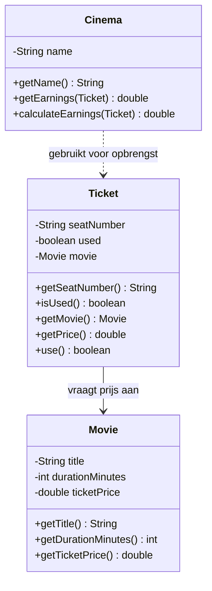

# Verantwoordelijkheden Opdracht 1: Bioscoop

## Movie (Film)

| Categorie | Beschrijving |
|-----------|--------------|
| **Weet zelf** | title (titel), durationMinutes (duur in minuten), ticketPrice (ticketprijs) |
| **Kent** | - |
| **Kan vragen beantwoorden** | Wat is de titel? Hoe lang duurt de film? Wat kost een ticket? |
| **Kan taken uitvoeren** | - |
| **Delegeert aan** | - |

## Ticket

| Categorie | Beschrijving |
|-----------|--------------|
| **Weet zelf** | seatNumber (stoelnummer, int), used (of het ticket gebruikt is) |
| **Kent** | Movie (de film waarvoor dit ticket geldig is) |
| **Kan vragen beantwoorden** | Wat is het stoelnummer? Is het ticket gebruikt? Wat is de prijs? Voor welke film is dit ticket? |
| **Kan taken uitvoeren** | Zichzelf markeren als gebruikt (use) |
| **Delegeert aan** | Movie voor de ticketprijs |

## Cinema (Bioscoop)

| Categorie | Beschrijving |
|-----------|--------------|
| **Weet zelf** | name (naam van de bioscoop) |
| **Kent** | - |
| **Kan vragen beantwoorden** | Wat is de naam? Wat is de opbrengst voor een ticket? |
| **Kan taken uitvoeren** | Opbrengst berekenen voor een ticket |
| **Delegeert aan** | Ticket voor de prijs (die weer delegeert aan Movie) |

## Delegatieketens

1. **Cinema vraagt opbrengst**: Cinema → vraagt aan Ticket wat de prijs is → Ticket vraagt aan Movie wat de ticketprijs is
   - **Let op**: Opbrengst = verkoop van ticket (onafhankelijk van gebruik). Ticket.use() is voor toegang, niet voor betaling.
2. **Ticket gebruik**: Ticket beheert zelf of het al gebruikt is; niemand anders mag dit aanpassen

## Klassendiagram

