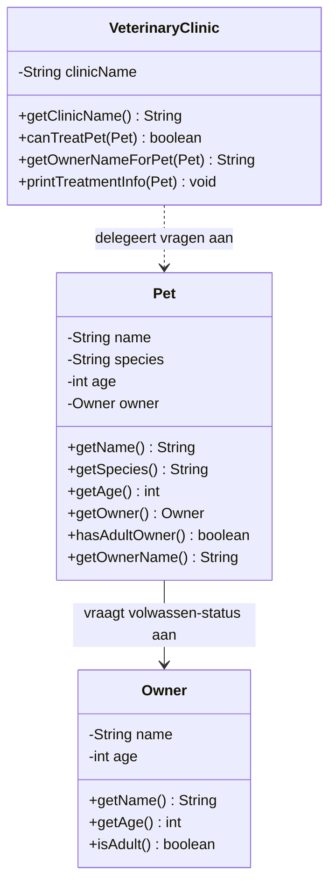

# Verantwoordelijkheden Opdracht 2: Huisdier

## Owner (Eigenaar)

| Categorie | Beschrijving |
|-----------|--------------|
| **Weet zelf** | name (naam), age (leeftijd) |
| **Kent** | - |
| **Kan vragen beantwoorden** | Wat is de naam? Hoe oud ben ik? Ben ik volwassen? |
| **Kan taken uitvoeren** | - |
| **Delegeert aan** | - |

## Pet (Huisdier)

| Categorie | Beschrijving |
|-----------|--------------|
| **Weet zelf** | name (naam), species (diersoort), age (leeftijd) |
| **Kent** | Owner (de eigenaar) |
| **Kan vragen beantwoorden** | Wat is mijn naam? Wat voor dier ben ik? Hoe oud ben ik? Is mijn eigenaar volwassen? Wat is de naam van mijn eigenaar? |
| **Kan taken uitvoeren** | - |
| **Delegeert aan** | Owner voor volwassen-check en eigenaarsnaam |

## VeterinaryClinic (Dierenkliniek)

| Categorie | Beschrijving |
|-----------|--------------|
| **Weet zelf** | clinicName (naam van de kliniek) |
| **Kent** | - |
| **Kan vragen beantwoorden** | Wat is de kliniknaam? Kan dit huisdier behandeld worden? Wat is de eigenaarsnaam voor dit huisdier? |
| **Kan taken uitvoeren** | Behandelingsinformatie tonen |
| **Delegeert aan** | Pet voor volwassen-check en eigenaarsnaam (de kliniek controleert NIET zelf de leeftijd!) |

## Delegatieketens

1. **Kan huisdier behandeld worden?**: VeterinaryClinic → vraagt aan Pet `hasAdultOwner()` → Pet vraagt aan Owner `isAdult()`
2. **Wat is de eigenaarsnaam?**: VeterinaryClinic → vraagt aan Pet `getOwnerName()` → Pet vraagt aan Owner `getName()`

**Belangrijk**: De dierenkliniek controleert NOOIT zelf de leeftijd van de eigenaar. Dit is de verantwoordelijkheid van Owner, en Pet delegeert deze vraag netjes door.

## Klassendiagram

