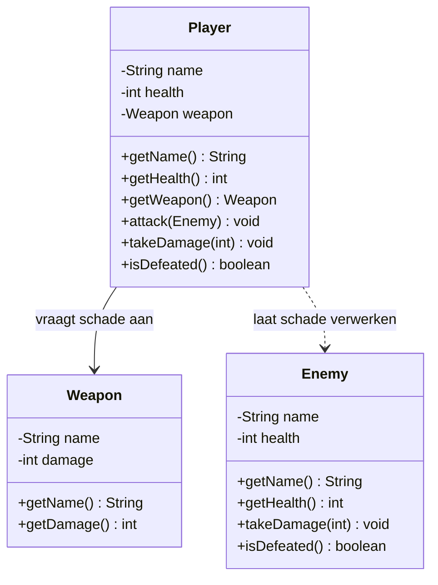

# Verantwoordelijkheden Opdracht 3: Game

## Weapon (Wapen)

| Categorie | Beschrijving |
|-----------|--------------|
| **Weet zelf** | name (naam), damage (schade) |
| **Kent** | - |
| **Kan vragen beantwoorden** | Wat is de naam? Hoeveel schade doe ik? |
| **Kan taken uitvoeren** | - |
| **Delegeert aan** | - |

## Enemy (Vijand)

| Categorie | Beschrijving |
|-----------|--------------|
| **Weet zelf** | name (naam), health (gezondheid) |
| **Kent** | - |
| **Kan vragen beantwoorden** | Wat is mijn naam? Hoeveel gezondheid heb ik? Ben ik verslagen? |
| **Kan taken uitvoeren** | Schade ontvangen en eigen gezondheid aanpassen |
| **Delegeert aan** | - |

## Player (Speler)

| Categorie | Beschrijving |
|-----------|--------------|
| **Weet zelf** | name (naam), health (gezondheid) |
| **Kent** | Weapon (het wapen) |
| **Kan vragen beantwoorden** | Wat is mijn naam? Hoeveel gezondheid heb ik? Ben ik verslagen? Welk wapen heb ik? |
| **Kan taken uitvoeren** | Aanvallen, schade ontvangen |
| **Delegeert aan** | Weapon voor schade-informatie; Enemy voor schade-verwerking |

## Delegatieketens

1. **Aanval uitvoeren**: Player → vraagt aan Weapon `getDamage()` → geeft schade door aan Enemy `takeDamage()`
2. **Schade verwerken**: Enemy beheert zelf zijn eigen gezondheid; Player past dit NIET aan via setters

**Belangrijk**: 
- Enemy is verantwoordelijk voor het bijhouden van eigen gezondheid
- Player vraagt alleen schade aan Weapon; de daadwerkelijke gezondheidsaanpassing is de taak van Enemy
- Gezondheid kan nooit onder 0 komen (invariant beheerd door de eigenaar van de data)

## Klassendiagram

