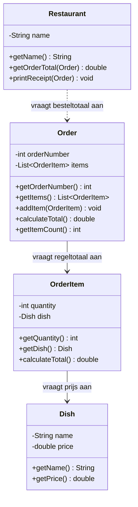

# Verantwoordelijkheden Opdracht 4: Restaurant

## Dish (Gerecht)

| Categorie | Beschrijving |
|-----------|--------------|
| **Weet zelf** | name (naam), price (prijs) |
| **Kent** | - |
| **Kan vragen beantwoorden** | Wat is de naam? Wat is de prijs? |
| **Kan taken uitvoeren** | - |
| **Delegeert aan** | - |

## OrderItem (Bestelregel)

| Categorie | Beschrijving |
|-----------|--------------|
| **Weet zelf** | quantity (aantal) |
| **Kent** | Dish (het gerecht) |
| **Kan vragen beantwoorden** | Hoeveel stuks? Welk gerecht? Wat is het totaal? |
| **Kan taken uitvoeren** | Regeltotaal berekenen |
| **Delegeert aan** | Dish voor de prijs per stuk |

## Order (Bestelling)

| Categorie | Beschrijving |
|-----------|--------------|
| **Weet zelf** | orderNumber (bestelnummer) |
| **Kent** | List<OrderItem> (de bestelregels) |
| **Kan vragen beantwoorden** | Wat is het bestelnummer? Hoeveel items? Wat is het totaal? |
| **Kan taken uitvoeren** | Items toevoegen, totaal berekenen |
| **Delegeert aan** | OrderItem voor regeltotalen |

## Restaurant

| Categorie | Beschrijving |
|-----------|--------------|
| **Weet zelf** | name (naam) |
| **Kent** | - |
| **Kan vragen beantwoorden** | Wat is de naam? Wat is het totaal van een bestelling? |
| **Kan taken uitvoeren** | Bon printen |
| **Delegeert aan** | Order voor besteltotaal |

## Delegatieketens

1. **Regeltotaal berekenen**: OrderItem → vraagt aan Dish `getPrice()` → berekent quantity × price
2. **Besteltotaal berekenen**: Order → vraagt aan elk OrderItem `calculateTotal()` → sommeert alle regeltotalen
3. **Restaurant vraagt totaal**: Restaurant → vraagt aan Order `calculateTotal()`

**Belangrijk**: 
- Order berekent NIET zelf de gerechtprijzen opnieuw; dit zou de verantwoordelijkheid van Dish stelen
- Elk niveau delegeert naar het volgende zonder de berekening over te nemen

## Klassendiagram

