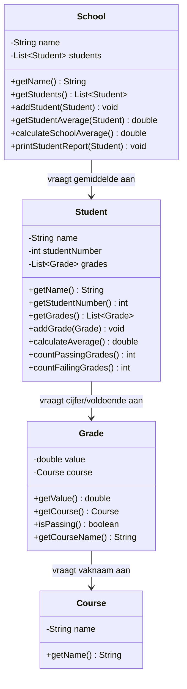

# Verantwoordelijkheden Opdracht 5: School

## Course (Vak)

| Categorie | Beschrijving |
|-----------|--------------|
| **Weet zelf** | name (naam van het vak) |
| **Kent** | - |
| **Kan vragen beantwoorden** | Wat is de vaknaam? |
| **Kan taken uitvoeren** | - |
| **Delegeert aan** | - |

## Grade (Cijfer)

| Categorie | Beschrijving |
|-----------|--------------|
| **Weet zelf** | value (cijferwaarde) |
| **Kent** | Course (het vak) |
| **Kan vragen beantwoorden** | Wat is het cijfer? Is het een voldoende? Wat is de vaknaam? |
| **Kan taken uitvoeren** | - |
| **Delegeert aan** | Course voor de vaknaam |

## Student

| Categorie | Beschrijving |
|-----------|--------------|
| **Weet zelf** | name (naam), studentNumber (studentnummer) |
| **Kent** | List<Grade> (de cijfers) |
| **Kan vragen beantwoorden** | Wat is mijn naam? Wat is mijn studentnummer? Wat is mijn gemiddelde? Hoeveel voldoendes/onvoldoendes heb ik? |
| **Kan taken uitvoeren** | Cijfer toevoegen, gemiddelde berekenen, voldoendes tellen |
| **Delegeert aan** | Grade voor cijferwaarde en voldoende-check |

## School

| Categorie | Beschrijving |
|-----------|--------------|
| **Weet zelf** | name (naam van de school) |
| **Kent** | List<Student> (de studenten) |
| **Kan vragen beantwoorden** | Wat is de schoolnaam? Wat is het gemiddelde van een student? Wat is het schoolgemiddelde? |
| **Kan taken uitvoeren** | Student toevoegen, rapport printen |
| **Delegeert aan** | Student voor gemiddeldes en cijferaantallen |

## Delegatieketens

1. **Is cijfer voldoende?**: Grade bepaalt ZELF of value >= 5.5 (de Student controleert dit NIET)
2. **Studentgemiddelde berekenen**: Student → vraagt aan elke Grade `getValue()` → berekent gemiddelde
3. **Voldoendes tellen**: Student → vraagt aan elke Grade `isPassing()` → telt true-waarden
4. **Schoolgemiddelde berekenen**: School → vraagt aan elke Student `calculateAverage()` → berekent gemiddelde

**Belangrijk**: 
- Grade is de enige die bepaalt of een cijfer voldoende is (>=5.5)
- Student vraagt dit aan Grade en telt alleen de resultaten

## Klassendiagram

