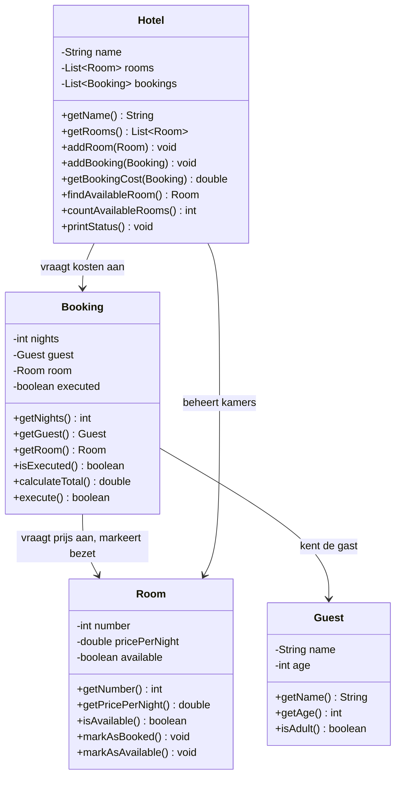

# Verantwoordelijkheden Opdracht 6: Hotel

## Guest (Gast)

| Categorie | Beschrijving |
|-----------|--------------|
| **Weet zelf** | name (naam), age (leeftijd) |
| **Kent** | - |
| **Kan vragen beantwoorden** | Wat is de naam? Hoe oud? Ben ik volwassen? |
| **Kan taken uitvoeren** | - |
| **Delegeert aan** | - |

## Room (Kamer)

| Categorie | Beschrijving |
|-----------|--------------|
| **Weet zelf** | number (kamernummer), pricePerNight (prijs per nacht), available (beschikbaar) |
| **Kent** | - |
| **Kan vragen beantwoorden** | Wat is het kamernummer? Wat is de prijs? Is de kamer beschikbaar? |
| **Kan taken uitvoeren** | Zichzelf markeren als bezet of beschikbaar |
| **Delegeert aan** | - |

## Booking (Boeking)

| Categorie | Beschrijving |
|-----------|--------------|
| **Weet zelf** | nights (aantal nachten), executed (uitgevoerd) |
| **Kent** | Guest (de gast), Room (de kamer) |
| **Kan vragen beantwoorden** | Hoeveel nachten? Wie is de gast? Welke kamer? Is de boeking uitgevoerd? Wat zijn de totale kosten? |
| **Kan taken uitvoeren** | Totaal berekenen, boeking uitvoeren |
| **Delegeert aan** | Room voor prijs per nacht en beschikbaarheid markeren |

## Hotel

| Categorie | Beschrijving |
|-----------|--------------|
| **Weet zelf** | name (naam) |
| **Kent** | List<Room> (kamers), List<Booking> (boekingen) |
| **Kan vragen beantwoorden** | Wat is de naam? Hoeveel kamers beschikbaar? Wat kost een boeking? |
| **Kan taken uitvoeren** | Kamer/boeking toevoegen, beschikbare kamer zoeken, status printen |
| **Delegeert aan** | Booking voor kosten, Room voor beschikbaarheid |

## Delegatieketens

1. **Boekingskosten berekenen**: Hotel → vraagt aan Booking `calculateTotal()` → Booking vraagt aan Room `getPricePerNight()`
2. **Boeking uitvoeren**: Booking → controleert Room `isAvailable()` → vraagt Room `markAsBooked()`
3. **Beschikbare kamer zoeken**: Hotel → vraagt aan elke Room `isAvailable()`

**Belangrijk**: 
- Room beheert zelf zijn beschikbaarheid; Booking past dit NIET rechtstreeks aan
- Booking vraagt Room om zichzelf als bezet te markeren

## Klassendiagram

