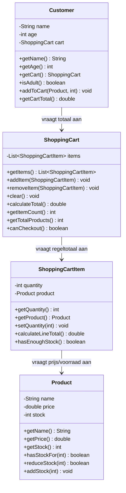

# Verantwoordelijkheden Opdracht 7: Webshop

## Product

| Categorie | Beschrijving |
|-----------|--------------|
| **Weet zelf** | name (naam), price (prijs), stock (voorraad) |
| **Kent** | - |
| **Kan vragen beantwoorden** | Wat is de naam? Wat is de prijs? Hoeveel voorraad? Is er voorraad voor N stuks? |
| **Kan taken uitvoeren** | Voorraad verminderen, voorraad toevoegen |
| **Delegeert aan** | - |

## ShoppingCartItem (Winkelwagenregel)

| Categorie | Beschrijving |
|-----------|--------------|
| **Weet zelf** | quantity (aantal) |
| **Kent** | Product |
| **Kan vragen beantwoorden** | Hoeveel stuks? Welk product? Wat is het regeltotaal? Is er genoeg voorraad? |
| **Kan taken uitvoeren** | Regeltotaal berekenen |
| **Delegeert aan** | Product voor prijs en voorraadcheck |

## ShoppingCart (Winkelwagen)

| Categorie | Beschrijving |
|-----------|--------------|
| **Weet zelf** | - |
| **Kent** | List<ShoppingCartItem> (de items) |
| **Kan vragen beantwoorden** | Hoeveel items? Hoeveel producten totaal? Wat is het totaal? Kan er afgerekend worden? |
| **Kan taken uitvoeren** | Items toevoegen/verwijderen, legen, totaal berekenen |
| **Delegeert aan** | ShoppingCartItem voor regeltotalen en voorraadcheck |

## Customer (Klant)

| Categorie | Beschrijving |
|-----------|--------------|
| **Weet zelf** | name (naam), age (leeftijd) |
| **Kent** | ShoppingCart (winkelwagen) |
| **Kan vragen beantwoorden** | Wat is de naam? Hoe oud? Ben ik volwassen? Wat is mijn winkelwagentotaal? |
| **Kan taken uitvoeren** | Product aan winkelwagen toevoegen |
| **Delegeert aan** | ShoppingCart voor totaal |

## Delegatieketens

1. **Regeltotaal berekenen**: ShoppingCartItem → vraagt aan Product `getPrice()` → berekent quantity × price
2. **Winkelwagentotaal**: ShoppingCart → vraagt aan elk ShoppingCartItem `calculateLineTotal()` → sommeert
3. **Klanttotaal**: Customer → vraagt aan ShoppingCart `calculateTotal()`
4. **Voorraadcheck**: ShoppingCartItem → vraagt aan Product `hasStockFor(quantity)`

**Belangrijk**: 
- Product is de enige die weet of er voorraad is (de voorraadvraag wordt door Product beantwoord)
- ShoppingCart vraagt NIET direct aan Product of er voorraad is, maar delegeert via ShoppingCartItem

## Klassendiagram

