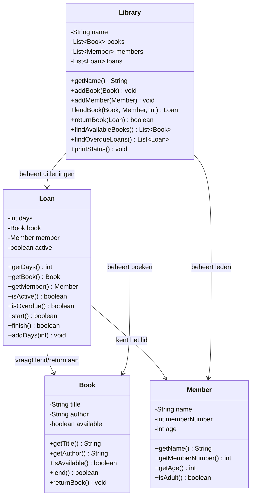

# Verantwoordelijkheden Opdracht 8: Bibliotheek

## Book (Boek)

| Categorie | Beschrijving |
|-----------|--------------|
| **Weet zelf** | title (titel), author (auteur), available (beschikbaar) |
| **Kent** | - |
| **Kan vragen beantwoorden** | Wat is de titel? Wie is de auteur? Is het boek beschikbaar? |
| **Kan taken uitvoeren** | Zichzelf markeren als uitgeleend (lend), zichzelf markeren als teruggebracht (returnBook) |
| **Delegeert aan** | - |

## Member (Lid)

| Categorie | Beschrijving |
|-----------|--------------|
| **Weet zelf** | name (naam), memberNumber (lidnummer), age (leeftijd) |
| **Kent** | - |
| **Kan vragen beantwoorden** | Wat is de naam? Wat is het lidnummer? Hoe oud? Ben ik volwassen? |
| **Kan taken uitvoeren** | - |
| **Delegeert aan** | - |

## Loan (Uitlening)

| Categorie | Beschrijving |
|-----------|--------------|
| **Weet zelf** | days (aantal dagen), active (actief) |
| **Kent** | Book (het boek), Member (het lid) |
| **Kan vragen beantwoorden** | Hoeveel dagen? Welk boek? Welk lid? Is de uitlening actief? Is het te laat? |
| **Kan taken uitvoeren** | Uitlening starten, uitlening beëindigen, dagen toevoegen |
| **Delegeert aan** | Book voor lend() en returnBook() |

## Library (Bibliotheek)

| Categorie | Beschrijving |
|-----------|--------------|
| **Weet zelf** | name (naam) |
| **Kent** | List<Book> (boeken), List<Member> (leden), List<Loan> (uitleningen) |
| **Kan vragen beantwoorden** | Wat is de naam? Welke boeken zijn beschikbaar? Welke uitleningen zijn te laat? |
| **Kan taken uitvoeren** | Boek/lid toevoegen, boek uitlenen, boek retourneren |
| **Delegeert aan** | Loan voor uitlenen/retourneren, Book voor beschikbaarheid, Loan voor te-laat-check |

## Delegatieketens

1. **Boek uitlenen**: Library → maakt Loan → Loan.start() → Book.lend()
2. **Boek retourneren**: Library → Loan.finish() → Book.returnBook()
3. **Te laat controleren**: Library → vraagt aan elke Loan `isOverdue()` (Loan weet zelf of days > 21)
4. **Beschikbaarheid**: Library → vraagt aan elk Book `isAvailable()`

**Belangrijk**: 
- Book markeert ZICHZELF als uitgeleend of beschikbaar
- Loan vraagt Book om zichzelf te markeren, past dit NIET rechtstreeks aan
- Loan bepaalt zelf of het te laat is (>21 dagen)

## Klassendiagram

