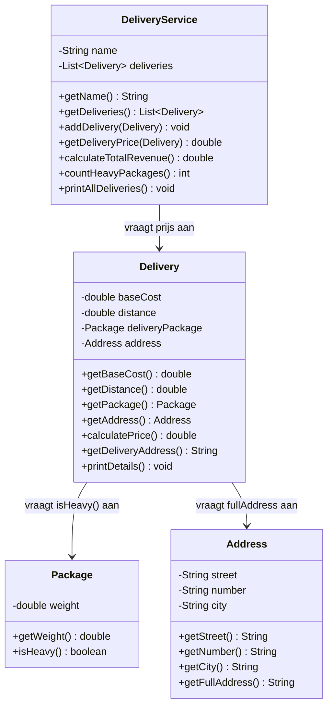

# Verantwoordelijkheden Opdracht 9: Bezorgdienst

## Address (Adres)

| Categorie | Beschrijving |
|-----------|--------------|
| **Weet zelf** | street (straat), number (huisnummer), city (stad) |
| **Kent** | - |
| **Kan vragen beantwoorden** | Wat is de straat? Wat is het huisnummer? Wat is de stad? Wat is het volledige adres? |
| **Kan taken uitvoeren** | - |
| **Delegeert aan** | - |

## Package (Pakket)

| Categorie | Beschrijving |
|-----------|--------------|
| **Weet zelf** | weight (gewicht) |
| **Kent** | - |
| **Kan vragen beantwoorden** | Hoeveel weegt het? Is het zwaar (>10kg)? |
| **Kan taken uitvoeren** | - |
| **Delegeert aan** | - |

## Delivery (Bezorging)

| Categorie | Beschrijving |
|-----------|--------------|
| **Weet zelf** | baseCost (basiskosten), distance (afstand) |
| **Kent** | Package (het pakket), Address (het adres) |
| **Kan vragen beantwoorden** | Wat zijn de basiskosten? Wat is de afstand? Wat is het bezorgadres? Wat is de prijs? |
| **Kan taken uitvoeren** | Prijs berekenen, details printen |
| **Delegeert aan** | Package voor zwaar-check, Address voor volledige adresregel |

## DeliveryService (Bezorgdienst)

| Categorie | Beschrijving |
|-----------|--------------|
| **Weet zelf** | name (naam) |
| **Kent** | List<Delivery> (bezorgingen) |
| **Kan vragen beantwoorden** | Wat is de naam? Wat is de prijs van een bezorging? Wat is de totale omzet? Hoeveel zware pakketten? |
| **Kan taken uitvoeren** | Bezorging toevoegen, alle bezorgingen printen |
| **Delegeert aan** | Delivery voor prijs, Delivery→Package voor zwaar-check |

## Delegatieketens

1. **Prijs berekenen**: DeliveryService → Delivery.calculatePrice() → vraagt Package.isHeavy()
   - Formule: baseCost + (distance × €0.50) + (€5.00 als Package.isHeavy())
2. **Adres ophalen**: Delivery → Address.getFullAddress()
3. **Zware pakketten tellen**: DeliveryService → elke Delivery → Package.isHeavy()

**Belangrijk**: 
- Package is de enige die bepaalt of het zwaar is (>10kg)
- Delivery vraagt dit aan Package en rekent de toeslag pas als Package zegt dat het zwaar is
- De bezorgdienst controleert NOOIT zelf het gewicht!

## Klassendiagram

