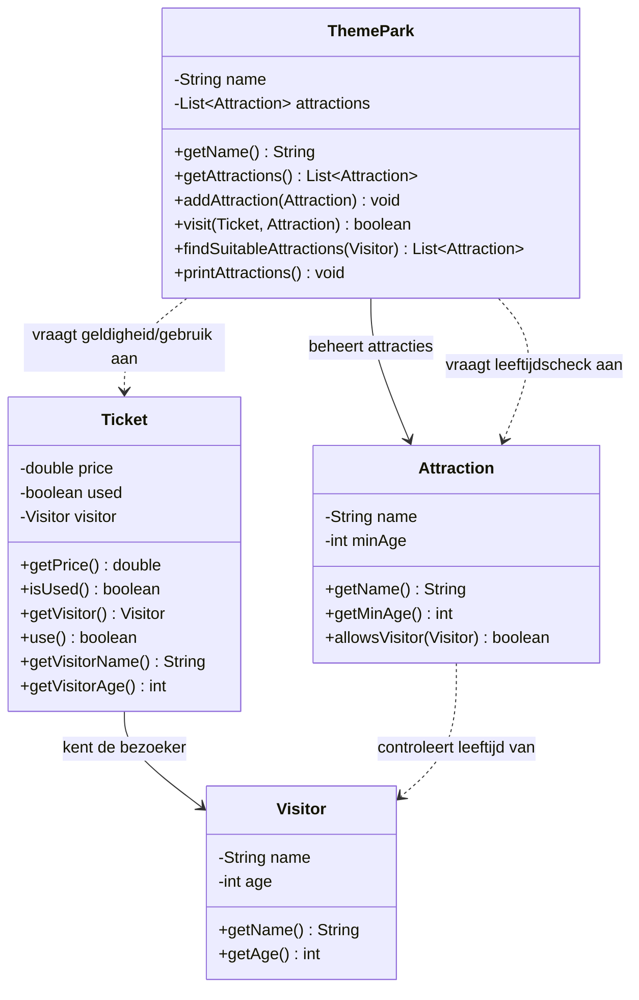

# Verantwoordelijkheden Opdracht 10: Pretpark

## Visitor (Bezoeker)

| Categorie | Beschrijving |
|-----------|--------------|
| **Weet zelf** | name (naam), age (leeftijd) |
| **Kent** | - |
| **Kan vragen beantwoorden** | Wat is de naam? Hoe oud ben ik? |
| **Kan taken uitvoeren** | - |
| **Delegeert aan** | - |

## Attraction (Attractie)

| Categorie | Beschrijving |
|-----------|--------------|
| **Weet zelf** | name (naam), minAge (minimumleeftijd) |
| **Kent** | - |
| **Kan vragen beantwoorden** | Wat is de naam? Wat is de minimumleeftijd? Mag deze bezoeker erin? |
| **Kan taken uitvoeren** | - |
| **Delegeert aan** | Visitor (parameter) voor leeftijd via getAge() |

## Ticket

| Categorie | Beschrijving |
|-----------|--------------|
| **Weet zelf** | price (prijs), used (gebruikt) |
| **Kent** | Visitor (de bezoeker) |
| **Kan vragen beantwoorden** | Wat is de prijs? Is het ticket gebruikt? Wie is de bezoeker? Wat is de naam/leeftijd van de bezoeker? |
| **Kan taken uitvoeren** | Zichzelf markeren als gebruikt (use) |
| **Delegeert aan** | Visitor voor naam en leeftijd |

## ThemePark (Pretpark)

| Categorie | Beschrijving |
|-----------|--------------|
| **Weet zelf** | name (naam) |
| **Kent** | List<Attraction> (attracties) |
| **Kan vragen beantwoorden** | Wat is de naam? Welke attracties zijn er? Welke attracties passen bij een bezoeker? |
| **Kan taken uitvoeren** | Attractie toevoegen, bezoek verwerken |
| **Delegeert aan** | Ticket voor geldigheid en gebruik, Attraction voor leeftijdscheck |

## Delegatieketens

1. **Bezoek verwerken** (ThemePark.visit):
   - ThemePark → Ticket.isUsed() (is ticket al gebruikt?)
   - ThemePark → Attraction.allowsVisitor(visitor) (is bezoeker oud genoeg?)
   - ThemePark → Ticket.use() (markeer ticket als gebruikt)

2. **Leeftijdscheck**: Attraction.allowsVisitor(visitor) → Visitor.getAge() → vergelijkt met minAge

3. **Geschikte attracties vinden**: ThemePark → vraagt aan elke Attraction `allowsVisitor(visitor)`

**Belangrijk**: 
- ThemePark controleert NIET zelf de leeftijd; dit is de verantwoordelijkheid van Attraction
- Ticket markeert ZICHZELF als gebruikt; ThemePark past dit niet rechtstreeks aan
- Een ticket kan maar één keer gebruikt worden (Ticket beheert deze invariant)
- Als de bezoeker te jong is, wordt het ticket NIET gemarkeerd als gebruikt

## Klassendiagram

